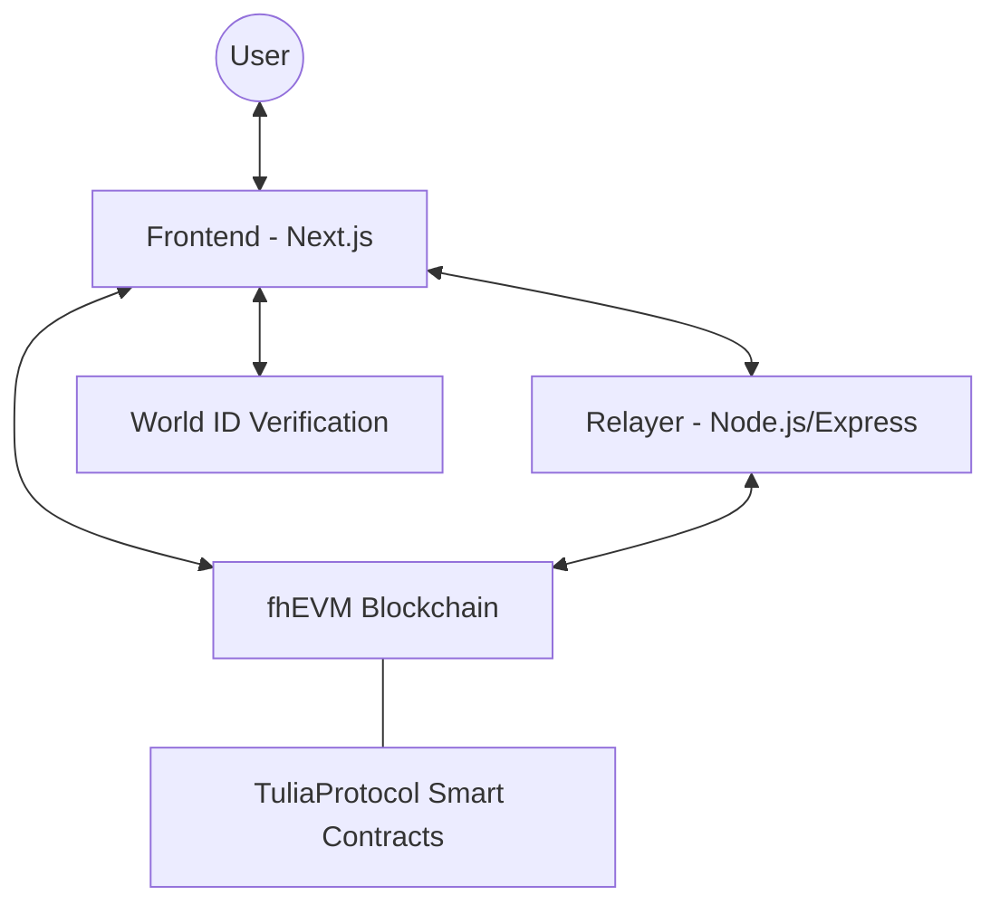

# 🛡️ TuliaPay: Privacy-First, Human-Only Financial Protocol

[](LICENSE)
[](https://docs.zama.ai/fhevm)
[](https://worldcoin.org/world-id)

TuliaPay is a state-of-the-art, **sybil-resistant** and **privacy-preserving** financial protocol. By combining **World ID** for human verification and **Zama's fhEVM** for Confidential Onchain Finance, TuliaPay ensures that financial activity on the blockchain is both authenticated by real humans and completely private from prying eyes.

---

## ✨ Key Features

- **👤 Human-Only Ecosystem:** Seamlessly integrated with **World ID** to ensure every user is a unique, verified human. No bots, no sybils.
- **🔐 End-to-End Confidentiality:** Leverages **Fully Homomorphic Encryption (FHE)**. Transaction amounts and balances are encrypted on the client side and remain encrypted while being processed on-chain.
- **⛽ Gasless Transactions:** Built-in relayer support allows users to interact with the protocol without needing native tokens for gas (subsidized by the protocol relayer).
- **📱 Optimized Experience:** A sleek Next.js 15 frontend designed for both desktop and World App mobile integration.

---

## 🏗️ Repository Architecture

This project is organized as a **monorepo** using **npm workspaces** for streamlined development and shared dependencies.



| Component | Path | Description |
| :--- | :--- | :--- |
| **Smart Contracts** | [`/smart-contracts`](./smart-contracts) | FHE-enabled Solidity contracts (TuliaProtocol.sol). |
| **Relayer (Backend)** | [`/backend`](./backend) | Handles transaction relaying and World ID verification proofs. |
| **Front-End** | [`/frontend`](./frontend) | The main dashboard and interaction portal for users. |
| **Documentation** | [`/docs`](./docs) | Detailed implementation plans and technical specifications. |

---

## 🚀 Getting Started

### 📋 Prerequisites

- **Node.js:** v20.x or higher
- **npm:** v10.x or higher
- **MetaMask** or a compatible Web3 wallet
- **World ID** (Optional for testing, required for full flow)

### 🛠️ Installation

1. **Clone the Repository:**
   ```bash
   git clone https://github.com/Doreen-Onyango/TuliaPay.git
   cd TuliaPay
   ```

2. **Install Root Dependencies:**
   ```bash
   npm install
   ```

### ⚙️ Environment Configuration

Each component requires its own configuration. Use the provided `.env.example` files as templates.

- **Frontend:** `cp frontend/.env.example frontend/.env`
- **Backend:** `cp backend/.env.example backend/.env`

*Refer to the component-specific READMEs for detailed environment variable descriptions.*

### 🏃 Running Locally

To run the full stack, you'll need three terminal sessions (or use a task runner like `concurrently` if configured):

#### 1. Smart Contracts (Compile & Test)
```bash
cd smart-contracts
npm run compile
# For local node testing:
npx hardhat node
```

#### 2. Backend Relayer
```bash
cd backend
npm run dev
```

#### 3. Frontend Dashboard
```bash
cd frontend
npm run dev
```

The frontend will be available at [http://localhost:3000](http://localhost:3000).

---

## 🔐 Security & Privacy Invariants

- **Zero Plaintext Logs:** No transaction amounts or user balances are ever stored in plaintext on the backend or on the public blockchain ledger.
- **Proof of Personhood:** All protocol writes (deposits/transfers) require a valid World ID verification state.
- **Localized Encryption:** Sensitive data is encrypted in the browser using `fhevmjs` before it ever reaches the network.

---

## 📄 License

This project is licensed under the **BSD-3-Clause-Clear License**. See the [LICENSE](LICENSE) file for details.

---

## 🤝 Contributing

We welcome contributions! Please check our [Implementation Plan](./docs/implementation_plan.md) to see the current roadmap.

**Built for a more private and human web.**
